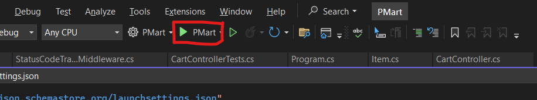
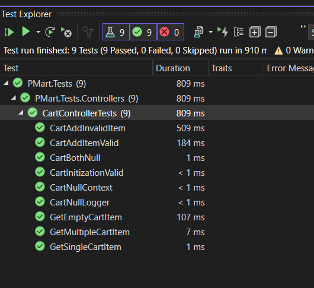
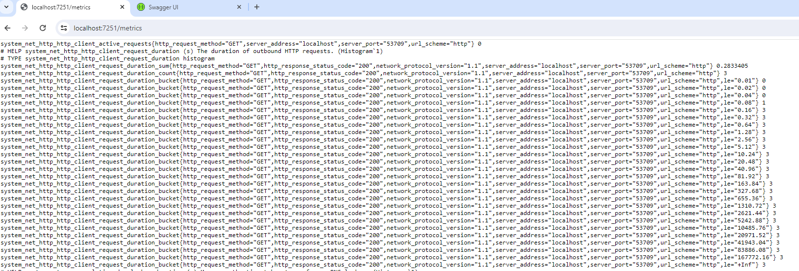

# PMart

PMart is a simple shopping cart service developed using ASP.NET Core. This project includes a RESTful API for adding and retrieving items in the shopping cart. The project utilizes SQLite as the database and follows best practices for code structure and maintainability.

## Table of Contents

- [Getting Started](#getting-started)
- [Prerequisites](#prerequisites)
- [Installation](#installation)
- [Run the application](#run-the-application)
- [API Endpoints](#api-endpoints)
- [Running the Tests](#running-the-tests)
- [Prometheus Metrics](#prometheus-metrics)


## Getting Started

Follow these instructions to get a copy of the project up and running on your local machine for development and testing purposes.

## Prerequisites

- [.NET SDK](https://dotnet.microsoft.com/download) (version 8.0 or higher)
- [SQLite](https://www.sqlite.org/download.html)

## Installation

1. Clone the repository:
    ```sh
    git clone https://github.com/your-username/PMart.git
    ```
2. Navigate to the project directory:
    ```sh
    cd PMart
    ```
3. Open Solution file (.sln) in Visual Studio 
4. Open Package Manager Console and execute following command
    ```sh
    PM > Update-Database
    ```

## Run the application

1. Click on the "PMart" to view the Swagger UI and interact with the API endpoints.



## API Endpoints

Here are the available API endpoints for the shopping cart service:

### Add an Item

- **URL:** `/api/cart/item`
- **Method:** `POST`
- **Request Body:**
    ```json
    {
        "name": "Item Name",
        "price": 10.99,
        "quantity": 5
    }
    ```
- **Response:**
    - `200 OK`: Returns the added item.
    - `400 Bad Request`: Invalid input.

### Get All Items

- **URL:** `/api/cart/items`
- **Method:** `GET`
- **Response:**
    - `200 OK`: Returns a list of items.

## Running the Tests

To run the unit tests and integration tests:

1. Open `View > Test Explorer` and execute all the tests



## Prometheus Metrics
The application exposes Prometheus metrics for monitoring purposes. 

To view the metrics locally, run the application and navigate to `localhost/metrics` while interacting with APIs to view the counters increment


